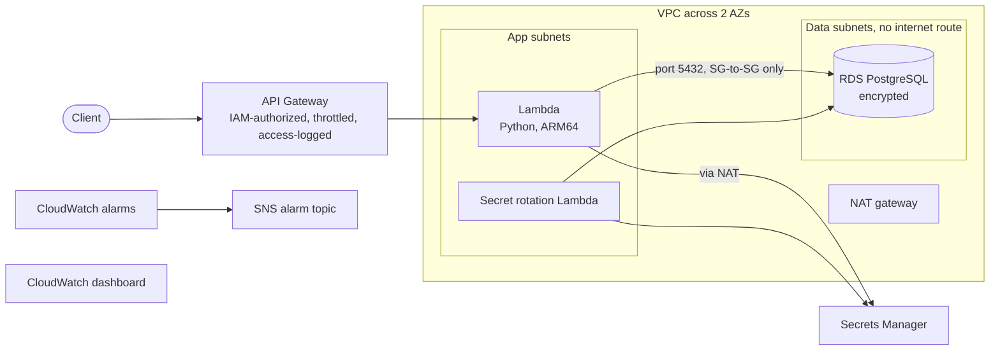

# Secure Serverless API on AWS (CDK + Python)

I build serverless architectures on AWS. This repo is a working demo of how I approach one: an API Gateway → Lambda → RDS PostgreSQL stack, defined entirely in AWS CDK (Python), where the database has no route to the internet and every permission is scoped to a specific resource, apart from the few AWS requires to be broad (tracing and VPC networking).

## How I use AI

I treat AI like flying an airplane. It gets a skilled pilot where they want to go very quickly, but it demands skill, constant attention to detail, and a deep understanding of safety and navigation rules.

In this repo, that looks like:

- [`CLAUDE.md`](CLAUDE.md) gives Claude Code the project's rules: stack dependency order, no hardcoded sizing, grants instead of hand-written IAM policies, and no boto3 without asking first.
- [`docs/cdk-well-architected.md`](docs/cdk-well-architected.md) explains each file's design against the six pillars of the AWS Well-Architected Framework.
- Every change is run through `cdk synth`, the `cdk-nag` security scan, and `mypy` before it's merged. These run locally; the repo has no CI pipeline yet.

## Architecture



- **Network:** A two-AZ VPC with three subnet tiers. Public subnets hold only the NAT gateway, app subnets hold Lambda, and data subnets hold RDS with no internet route in either direction.
- **API and compute:** API Gateway routes to a Python Lambda running on Graviton (ARM64). The stage is throttled and writes JSON access logs, and X-Ray tracing is on. Every route requires a request signed by an approved AWS identity (IAM), except an open `GET /health` for uptime monitors.
- **Data:** RDS PostgreSQL with encrypted storage. Inbound access is limited to two security groups on port 5432: the API's Lambda and the secret-rotation Lambda.
- **Credentials:** RDS generates the database password, stores it in Secrets Manager, and rotates it every 30 days. No credentials live in code or environment variables.
- **Observability:** Each stack defines alarms for its own resources and sends them to one shared SNS topic, which emails the address you give at deploy time. Every log group belongs to a stack, including the ones AWS services would otherwise create on their own (database, password rotation, API Gateway errors), so retention and clean-up follow `DemoConfig`. A separate stack builds a dashboard that combines RDS, Lambda, and API metrics.

## Engineering details worth a look

- **No boto3.** The handler reads the database secret through the AWS Parameters and Secrets Lambda Extension, a local HTTP endpoint with built-in caching, using only the standard library.
- **Least privilege through grants.** Lambda's access is `db_secret.grant_read()`, scoped to one secret ARN. The remaining wildcard permissions come from X-Ray and VPC networking, which AWS requires, and are documented as accepted findings.
- **The database is protected from Lambda bursts.** Reserved concurrency caps how many Lambdas can hold connections at once, and an alarm fires when that cap is hit.
- **Cycle-free stacks.** Dependencies flow `vpc → database → compute → monitoring`. Turning on secret rotation would have created a circular dependency between the VPC and database stacks, so the DB security group lives with the database. The design doc explains why.
- **One config object.** A frozen `@dataclass` in `app.py` holds every size, count, retention period, and removal policy, so moving to production means changing config rather than editing stacks.
- **Verified.** `cdk synth` passes, `mypy` reports no issues, and the `cdk-nag` scan passes: every remaining finding is suppressed in `app.py` with its reason and listed in the design doc.

## Demo defaults vs. production

This is a demo, and some settings are deliberately cheap or disposable. Each one is a `DemoConfig` value or a documented next step.

| Area | Demo setting | Production change |
|---|---|---|
| RDS availability | Single-AZ, 1-day backups | Multi-AZ, 7+ day backups, deletion protection |
| Teardown | `RemovalPolicy.DESTROY` for everything | `removal_policy=RETAIN`; `db_removal_policy=SNAPSHOT` (final backup) or `RETAIN` |
| NAT | One gateway | One per AZ |
| Logs | 1-week retention | 30+ days |
| Database insight | Performance Insights off (not available on `db.t4g.micro`) | Larger instance, `db_performance_insights=True` |
| API access | IAM on every route except an open `/health`; no WAF | WAFv2 web ACL; Cognito or Lambda authorizer if customers sign in |

## Project structure

```
├── CLAUDE.md                       # Rules for Claude Code
├── app.py                          # DemoConfig, tags, stack wiring
├── cdk.json                        # Tells the CDK CLI how to run app.py
├── requirements.txt                # Pinned CDK libraries
├── requirements-dev.txt            # Adds cdk-nag and mypy
├── docs/
│   └── cdk-well-architected.md     # Design rationale per file
├── infrastructure/
│   ├── vpc_stack.py                # VPC, subnets, flow logs, Lambda SG, alarm topic
│   ├── database_stack.py           # RDS, DB SG, secret rotation, DB alarms
│   ├── compute_stack.py            # API Gateway, Lambda, IAM grants, alarms
│   └── monitoring_stack.py         # Cross-stack CloudWatch dashboard
└── runtime/
    └── handler.py                  # Lambda handler (no boto3)
```

## Try it yourself

> **Cost warning:** The NAT gateway and RDS instance bill by the hour whether or not the API gets traffic. Run `cdk destroy --all` when you're done, and check the [AWS Pricing Calculator](https://calculator.aws/) for current rates in your region.

**Prerequisites:** An AWS account with credentials configured, Node.js (for the CDK CLI), and Python 3.11+.

```bash
npm install -g aws-cdk
python -m venv .venv && source .venv/bin/activate
pip install -r requirements.txt
pip install -r requirements-dev.txt    # optional: security scan and type checks
```

The app deploys to the account and region of your current AWS CLI profile. Then:

```bash
cdk bootstrap                # once per account/region
cdk synth                    # build the CloudFormation templates
cdk synth -c nag=1           # optional security scan
cdk deploy --all -c alarm_email=you@example.com   # AWS emails you a link to confirm alerts
```

The compute stack prints an `ApiEndpoint` output. Call the open health check to confirm the Lambda can reach its secret and the database (it answers `{"status": "ok"}`):

```bash
curl <ApiEndpoint>health
```

`/items` requires a request signed by an AWS identity allowed to invoke the API, for example with [awscurl](https://github.com/okigan/awscurl):

```bash
awscurl --region <region> <ApiEndpoint>items
```

Tear everything down. With the demo settings this also deletes the log groups and API Gateway's logging role, which is shared by every API in the account and Region:

```bash
cdk destroy --all
```

## How I work with clients

When I work with agencies or clients, they keep control of their AWS accounts. I work through role-based access they grant, scoped to the project and limited in time, and every change goes through IaC so it can be reviewed and audited.
